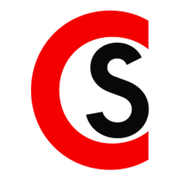

# CloudSnap



Скриншотер и запись экрана с автоматической выгрузкой в Nextcloud через WebDAV для Windows и MacOS.

## Содержание

- [Документация](src/ui/docs-window/docs.html)
- [Технологии разработки](#технологии-разработки)
- [Требования](#требования)
- [Быстрый старт](#быстрый-старт)
- [Разработка](#разработка)
- [Сборка через Docker (кросс-платформенная)](#сборка-через-docker)
- [Локальная сборка](#локальная-сборка)
- [Артефакты](#артефакты)
- [Очистка](#очистка)

---

## Технологии разработки

**IDE:** VS Code

**Стек:** Electron + TypeScript

**Контейнеризация:** Docker

**Используемые ИИ при разработке:**

- Gemini Flash 3.5 Web (Расширенный) - до лимита
- Qwen 3.7 Max Agent - 3кк токенов
- Qwen 3.7 Plus Agent - 3кк токенов
- Qwen 3.6 Plus Agent - 3кк токенов
- Deepseek v4 Pro Agent - 3кк токенов
- GLM 5.1 Agent - 3кк токенов
- Cursor Agent - Free период
- GitHub Copliot - Free период

Отладка:

- Claude Code Opus 4.8

- Owl Alpha

Общее затраченное время на текущее состояние проекта: **~46 часов**

---

## Требования

### Для разработки

| Инструмент | Минимальная версия |
| ---------- | ------------------ |
| Node.js    | 20+                |
| npm        | 10+                |
| TypeScript | 6+                 |
| Electron   | 28+                |

### Для контейнерной сборки

| Инструмент     | Минимальная версия |
| -------------- | ------------------ |
| Docker         | 24+                |
| Docker Compose | 2.20+              |

### Для локальной сборки Windows

- Windows 10/11
- Node.js 20+

### Для локальной сборки macOS

- macOS 12+ (Monterey / Ventura / Sonoma)
- Xcode Command Line Tools (`xcode-select --install`)
- Node.js 20+

---

## Быстрый старт

```bash
# Установка зависимостей
npm install

# Компиляция TypeScript
npm run build

# Запуск приложения
npm start
```

---

## Разработка

```bash
# Запуск в dev-режиме (tsc + electron)
make dev
# или
npm start

# TypeScript watch-режим (фон)
make watch
# или
npm run watch
```

Приложение запускается в системном трее. Горячие клавиши по умолчанию:

- `Ctrl+Shift+A` — снимок экрана
- `Ctrl+Shift+V` — старт/пауза записи
- `Ctrl+Shift+S` — остановить запись

---

## Сборка через Docker

Контейнер `build/universal/` содержит wine + Xvfb + electron-builder и собирает **обе платформы из одного образа** на любой ОС (Linux, Windows, macOS).

### Первый запуск — сборка образа

```bash
docker compose build cloudsnap
```

> **Важно:** Образ весит ~1.5 GB (wine + Node.js + Electron). Сборка занимает 5–10 минут.

### Сборка обеих платформ

```bash
mkdir -p dist/output

docker compose run --rm -v ./dist/output:/output cloudsnap all
```

### Сборка только Windows (.exe)

```bash
docker compose run --rm -v ./dist/output:/output cloudsnap win
```

### Сборка только macOS (.zip)

```bash
docker compose run --rm -v ./dist/output:/output cloudsnap mac
```

### Через Makefile

```bash
make build          # обе платформы
make build-win      # только .exe
make build-mac      # только macOS .zip
```

### Что происходит внутри контейнера

1. Запуск Xvfb (виртуальный экран для wine)
2. Инициализация wine prefix (`wineboot`)
3. Компиляция TypeScript (`npx tsc`)
4. Windows: `electron-builder --win --x64` → NSIS-инсталлер через wine
5. macOS: `electron-builder --mac zip --x64` → unsigned .app bundle
6. Копирование артефактов в `/output/`

### Результат в `dist/output/`

| Файл                        | Описание                                     |
| --------------------------- | -------------------------------------------- |
| `CloudSnap Setup 1.0.4.exe` | NSIS-инсталлер для Windows                   |
| `CloudSnap-1.0.4-mac.zip`   | Unsigned .app bundle для macOS (development) |

> **macOS .zip — не production-билд.** Для signed .dmg нужна macOS-машина (см. ниже).

---

## Локальная сборка

### Windows — .exe на Windows-машине

```bash
npm install --save-dev @types/node@latest electron-builder@latest && npm run build:win
# или
make build-local-win
```

Результат: `dist/CloudSnap Setup 1.0.4.exe`

### macOS — signed .dmg на Mac-машине

```bash
npm install --save-dev @types/node@latest electron-builder@latest && npm run build:mac
# или
make build-local-mac
```

> **Требования для macOS-сборки:**
> 
> - Xcode Command Line Tools: `xcode-select --install`
> - `entitlements.mac.plist` в корне проекта (уже есть)
> - Для code signing: Apple Developer ID + сертификат (опционально)

Результат: `dist/CloudSnap-1.0.4.dmg`

---

## Артефакты

| Платформа | Формат                 | Метод сборки           | Code signing                                     |
| --------- | ---------------------- | ---------------------- | ------------------------------------------------ |
| Windows   | `.exe` (NSIS)          | Docker / локально / CI | Нет (опционально)                                |
| macOS     | `.dmg`                 | Локально на Mac / CI   | hardenedRuntime (опционально Apple Developer ID) |
| macOS     | `.zip` (unsigned .app) | Docker                 | Нет — development-билд                           |

### Ограничения macOS-сборки в Docker

`electron-builder --mac` в Linux-контейнере может создать только **unsigned .zip** с .app bundle внутри. Apple не позволяет использовать macOS SDK и code signing на не-Apple оборудовании. Для production:

| Способ                        | Результат                                 |
| ----------------------------- | ----------------------------------------- |
| Docker контейнер              | unsigned `.zip` — только для тестирования |
| Mac-машина локально           | `.dmg` — production-ready                 |
| GitHub Actions `macos-latest` | `.dmg` — production-ready + code signing  |

---

## Очистка

```bash
# Удалить dist/ и скомпилированные .js
make clean

# Удалить Docker-образы
make clean-docker

# Полная очистка
make clean && make clean-docker
```

---

## Команды Makefile (справка)

```bash
make help
```

| Команда                | Описание                                  |
| ---------------------- | ----------------------------------------- |
| `make dev`             | Запуск приложения (tsc + electron)        |
| `make watch`           | TypeScript watch-режим                    |
| `make build`           | Docker: обе платформы (.exe + macOS .zip) |
| `make build-win`       | Docker: только Windows .exe               |
| `make build-mac`       | Docker: только macOS .zip (unsigned)      |
| `make build-local-win` | Локально: .exe на Windows-машине          |
| `make build-local-mac` | Локально: signed .dmg на Mac-машине       |
| `make clean`           | Удалить dist/ и скомпилированные .js      |
| `make clean-docker`    | Удалить Docker-образы                     |

---

## macOS — системные разрешения

При первом запуске на macOS приложение проверяет два разрешения:

1. **Запись экрана** — Системные настройки → Конфиденциальность → Запись экрана → добавить CloudSnap
2. **Универсальный доступ** — Системные настройки → Конфиденциальность → Универсальный доступ → добавить CloudSnap (для режима «Окно» и записи области)

Без разрешения «Запись экрана» desktopCapturer вернёт пустые/чёрные thumbnails. Без «Универсального доступа» режим «Окно» не сможет определять границы окон.
